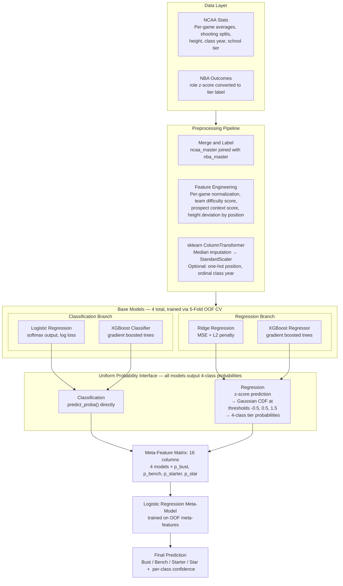
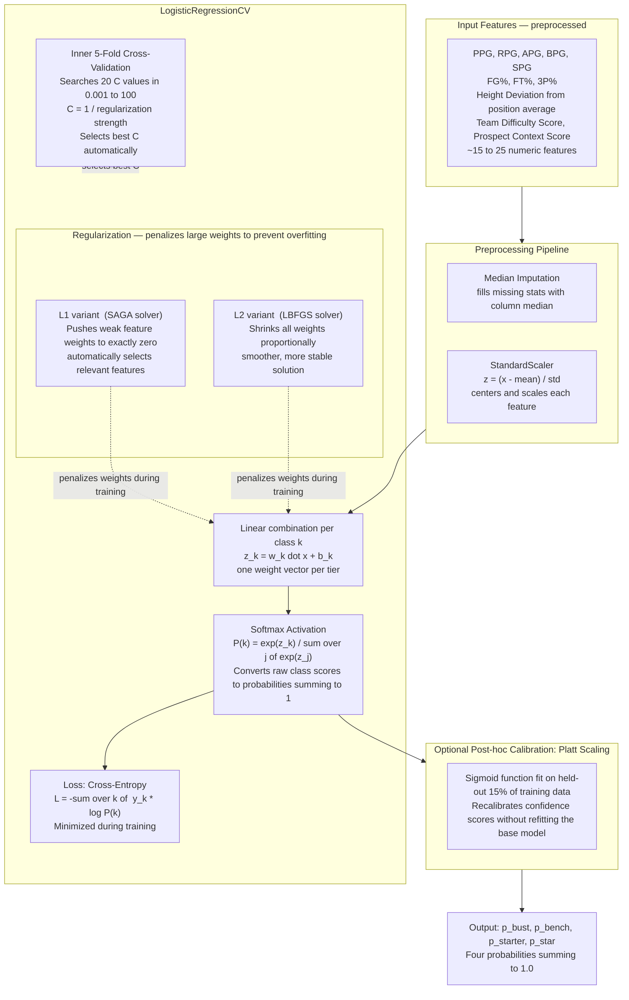
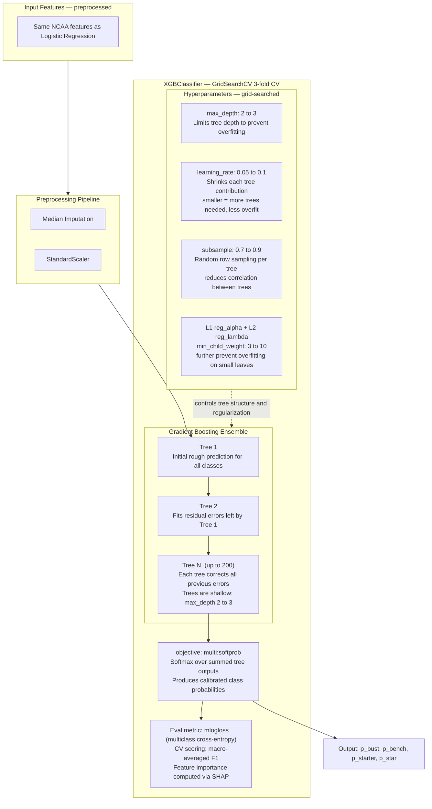
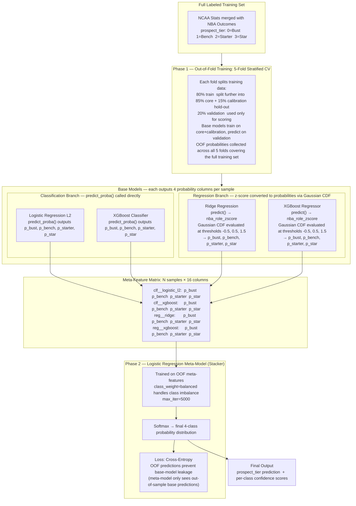

# NBA Draft ML Research

## Goal

Predict NBA draft success using:

- College statistics (regression and classification)
- Scouting reports (NLP text model)
- Combined stats + scouting (multimodal model)

---

## Model Architecture

This project uses a **probability stacking ensemble** (PSM). Tabular classification and regression base models are trained via out-of-fold cross-validation; their probability outputs are stacked into a meta-feature matrix that a logistic regression meta-model learns to combine.

### Prospect Tier Labels

Tiers are derived from each player's `nba_role_zscore` — a composite of NBA performance statistics:

| Tier | Label | z-score |
|------|-------|---------|
| 0 | Bust | < −0.5 |
| 1 | Bench | −0.5 to 0.5 |
| 2 | Starter | 0.5 to 1.5 |
| 3 | Star | > 1.5 |

---

### Full System Overview



---

### Logistic Regression Classifier

A linear model that learns a weighted combination of NCAA features and applies softmax to assign each prospect to one of four tiers. Two regularization variants are trained: **L1** (SAGA solver, drives unimportant feature weights to zero) and **L2** (LBFGS solver, shrinks all weights smoothly).



---

### XGBoost Classifier

An ensemble of shallow decision trees trained **sequentially** via gradient boosting. Each new tree corrects the residual errors of all previous trees, producing a powerful non-linear classifier without requiring manual feature engineering.



---

### Multi-Modal Probability Stacking

The multi-modal model is a **stacking ensemble**. Each base model independently produces 4-class probability estimates from the same NCAA input features. These are concatenated into a 16-column meta-feature matrix, and a logistic regression meta-model learns the optimal weighted combination across all base models.

Training uses **out-of-fold (OOF) cross-validation** so the meta-model trains on predictions the base models made on data they never saw during their own training — this prevents information leakage.



---

## Project Structure

```
sport-prospect-grading/
├── src/
│   ├── main.py                      # Entry point — CLI args, config loading, model dispatch
│   ├── config/
│   │   └── config.yaml              # Centralized config for all model types
│   ├── models/
│   │   ├── regression_model.py      # Lasso / Ridge / XGBoost regression
│   │   ├── classification_model.py  # LogisticL1 / LogisticL2 / XGBoost classification
│   │   ├── multimodal.py            # Probability stacking ensemble (OOF + meta-model)
│   │   ├── multimodal_reporting.py  # Evaluation metrics and output tables for multimodal runs
│   │   ├── probability.py           # Shared probability interface (BaseModelBundle, CDF conversion)
│   │   ├── classification_inference.py  # Inference utilities for fitted classification models
│   │   ├── text_model.py            # Transformer encoder on scouting reports
│   │   └── interpret_text.py        # Occlusion, probes, log-odds, VADER correlations
│   ├── data/
│   │   ├── loader.py                # Tabular data loading, feature engineering, preprocessing
│   │   └── dataset.py               # PyTorch Dataset for text/multimodal models
│   ├── training/
│   │   ├── splits.py                # Train/val/test splitting utilities
│   │   └── evaluate.py              # Metrics: MAE, RMSE, R², accuracy, ROC-AUC
│   └── utils/
│       ├── device.py                # Auto-detects CPU / MPS / CUDA
│       ├── features.py              # Feature name expansion and importance helpers
│       ├── plotting.py              # Model summary and feature importance plots (local only)
│       └── mlflow_utils.py          # MLflow context, run naming, logging helpers
├── data/
│   ├── nba/                         # NBA master list and per-season stats
│   ├── ncaa/                        # NCAA master list and annual stats
│   ├── scouting/                    # Scouting report texts and player attribute CSVs
│   └── scripts/                     # Data fetch, parse, and reconciliation scripts
├── outputs/
│   └── plots/                       # Per-run local plot output (one subfolder per run name)
├── scripts/
│   ├── start_mlflow_ui.sh
│   └── start_mlflow_server.sh
├── MLFLOW_LOGGING.md                # MLflow logging specification
└── pyproject.toml
```

#### `src/models/`
- **`regression_model.py`**: Lasso/Ridge/XGBoost regression predicting `nba_role_zscore` (or `plus_minus`) from final-year NCAA college stats.
- **`classification_model.py`**: LogisticL1/LogisticL2/XGBoost classification predicting `prospect_tier` from NCAA stats.
- **`multimodal.py`**: Probability stacking ensemble — trains base models via 5-fold OOF CV, builds a 16-column meta-feature matrix, and fits a logistic regression meta-model.
- **`multimodal_reporting.py`**: Evaluation tables, per-class metrics, and output CSVs for multimodal runs.
- **`probability.py`**: Shared `BaseModelBundle` interface: `predict_tier_proba()` for all base models, Gaussian CDF conversion for regression outputs, and post-hoc calibration utilities.
- **`classification_inference.py`**: Inference utilities for applying fitted classification models to new data.
- **`text_model.py`**: NLP encoder (ScoutingReportEncoder) for fine-tuning transformer models on scouting report texts. Pass `save_path=` to `train_and_evaluate_text_model` to persist weights for interpretability.
- **`interpret_text.py`**: Probes, aggregated occlusion, corpus log-odds, VADER sentiment correlations, and `outputs/interpretability/REPORT.md` for all prediction heads.

#### `src/training/`
- **`splits.py`**: Train/val/test splitting utilities with stratified and chronological modes.
- **`evaluate.py`**: Evaluation metrics (MAE, RMSE, R², accuracy, ROC-AUC, ordinal metrics).

#### `src/data/`
- **`loader.py`**: Tabular data loading, NCAA/NBA merging, feature engineering, and sklearn `ColumnTransformer` pipeline construction.
- **`dataset.py`**: PyTorch Dataset classes (`ProspectStatsDataset`, `ScoutingReportDataset`) for loading NCAA stats and tokenized scouting reports.

#### `src/utils/`
- **`device.py`**: Auto-detects and logs compute device (CUDA > MPS > CPU); respects `DEVICE` env var.
- **`features.py`**: Feature name expansion, Lasso coefficient display, XGBoost feature importance ranking.
- **`plotting.py`**: Feature importance, model comparison, and results plots. Uses Matplotlib Agg backend (non-interactive).
- **`mlflow_utils.py`**: Parent + nested child run structure, parameter/metric/artifact logging helpers.

#### `src/config/`
- **`config.yaml`**: Centralized YAML configuration for model type, target, feature flags, hyperparameter search ranges, training settings, data paths, and MLflow tracking URI.

### Data Processing Scripts

#### `data/scripts/`
- **`fetch_nba_stats.py`**: Fetches season-level NBA stats using nba-api for all players across draft classes.
- **`parse_ncaa_stats.py`**: Parses NCAA stats from raw data into structured DataFrames.
- **`reconcile_master.py`**: Reconciles NCAA and NBA data to link prospects with their professional performance.
- **`reconcile_from_ncaa_master.py`**: Re-derives the reconciled master list directly from `ncaa_master.csv`.
- **`backfill_ncaa_stats.py`**: Backfills missing NCAA stats from ESPN box scores (~2 GB, ~2 min).
- **`augment_new_seasons.py`**: Appends new draft-class seasons to the existing NCAA stats.
- **`recover_nba_players.py`**: Recovers missing NBA players from the master list.
- **`validate_recovered_players.py`**: Sanity-checks recovered player records against known data.
- **`backfill_profile.py`**: Backfills player profile fields (height, position, etc.) from secondary sources.

### Data Directories

#### `data/nba/`
- **`nba_master.csv`**: Master list of NBA draft prospects mapped to professional performance.
- **`nba_stats_best_season.csv`**: Best-season NBA stats for each drafted prospect (composite scoring).
- **`season_cache/`**: Season-by-season NBA stats (2009–10 through 2025–26).

#### `data/ncaa/`
- **`ncaa_master.csv`**: Master list of NCAA prospects.
- **`ncaa_stats_master.csv`**: Aggregated NCAA statistics.
- **`YYYY-ZZZZ.csv`**: Annual NCAA stats files.

#### `data/scouting/`
- **`players.csv` / `players.jsonl`**: Master prospect data with scouting ratings and attributes.
- **`scouting_texts.txt`**: Raw scouting report text used by the text model.

### Configuration & Infrastructure

- **`pyproject.toml`**: Project metadata and dependencies (PyTorch, Transformers, scikit-learn, MLflow, Weights & Biases).
- **`mlruns/`**: MLflow experiment tracking artifacts and model snapshots.
---

## Setup

### Prerequisites

- Python 3.11 or 3.12
- [uv](https://docs.astral.sh/uv/getting-started/installation/) package manager

### Install

```bash
git clone <repo-url>
cd sport-prospect-grading
uv sync
cp .env.example .env
# Edit .env if needed (see Environment Variables below)
```

---

## Running Models

All models are launched through `src/main.py`. The `--model` flag selects the pipeline and is the primary switch.

### Basic usage

```bash
uv run python src/main.py --model regression
uv run python src/main.py --model classification
uv run python src/main.py --model multimodal
uv run python src/main.py --model text
```

### All CLI arguments

| Argument | Type | Default | Description |
|---|---|---|---|
| `--model` | `regression \| classification \| text \| multimodal` | value from `config.yaml` | Selects which model pipeline to run. Overrides `model.type` in config. |
| `--config` | path | `src/config/config.yaml` | Path to the YAML config file. |
| `--run-name` | string | auto-generated | MLflow parent run name. **Use this to label and differentiate runs.** |
| `--epochs` | int | value from config | Override `training.epochs` for text/multimodal models. |
| `--output-dir` | path | value from config | Override the output directory. |
| `--tracking-uri` | URI or path | value from config or `MLFLOW_TRACKING_URI` env var | Override the MLflow tracking URI for this run only. |

### Naming runs

The `--run-name` flag is the recommended way to distinguish runs when comparing results in MLflow.

```bash
# Label a regression run clearly for comparison
uv run python src/main.py --model regression --run-name regression-baseline-no-pick
uv run python src/main.py --model regression --run-name regression-with-pick

# Label a classification run
uv run python src/main.py --model classification --run-name clf-prospect-tier-v1

# Label a multimodal stacking run
uv run python src/main.py --model multimodal --run-name multimodal-lgb-xgb-v1
```

### Text model interpretability

Train with a checkpoint path, then run interpretability (from repo root):

```bash
uv run python -c "from src.models.text_model import train_and_evaluate_text_model; train_and_evaluate_text_model(save_path='outputs/checkpoints/text_model.pt')"

uv run python -m src.models.interpret_text --checkpoint outputs/checkpoints/text_model.pt
```

Fast run (smaller/faster occlusion):

```bash
uv run python -m src.models.interpret_text --checkpoint outputs/checkpoints/text_model.pt --n-occlusion 20 --max-variants-per-report 40
```

Use `--retrain --checkpoint-out ...` to train and interpret in one step. Outputs land in `outputs/interpretability/`.

### Auto-generated run names

If `--run-name` is omitted, a name is auto-generated using the pattern:

```
{model_type}-{target}-{YYYYMMDD-HHMMSS}-{user}-{git_sha}
```

Example: `regression-nba_role_zscore-20260423-143012-kincaid-c79bc0f`

The run name is used as:
- The MLflow parent run name
- The subfolder name under `outputs/plots/` where local PNGs are saved

---

## Configuration

`src/config/config.yaml` controls all model behavior. CLI flags override specific fields at runtime; all other values come from the file.

### Regression (`--model regression`)

```yaml
model:
  regression:
    target_mode: nba_role_zscore  # nba_role_zscore | plus_minus | composite_score
    use_draft_pick: true          # set false to exclude draft pick position as a feature
    alpha_min: 1e-4               # Lasso/Ridge alpha search range (lower bound)
    alpha_max: 1e2                # Lasso/Ridge alpha search range (upper bound)
    alpha_steps: 100              # number of alpha candidates
    cv_folds: 5                   # CV folds for Lasso and Ridge
    xgboost:
      n_estimators: [100, 200]    # grid search values
      max_depth: [2, 3]
      learning_rate: [0.05, 0.1]
      subsample: [0.7, 0.9]
      colsample_bytree: [0.7, 1.0]
      min_child_weight: [3, 5, 10]
      reg_alpha: [0, 0.1, 1]
      reg_lambda: [1, 5, 10]
      gamma: [0]
      cv_folds: 3                 # CV folds for XGBoost grid search
      n_jobs: 1                   # XGBoost worker threads; keep 1 on macOS for stability
      grid_n_jobs: 1              # GridSearchCV worker processes
      pre_dispatch: 1             # Jobs queued ahead of active workers
```

Trains three models: **Lasso**, **Ridge**, **XGBoost**. Each gets its own nested MLflow run under the parent. XGBoost uses `GridSearchCV` over the values listed above.

### Classification (`--model classification`)

```yaml
model:
  classification:
    target_mode: prospect_tier    # prospect_tier | became_starter
    use_draft_pick: false
    xgboost:
      n_estimators: [100, 200]
      max_depth: [2, 3]
      learning_rate: [0.05, 0.1]
      subsample: [0.7, 0.9]
      colsample_bytree: [1.0]
      min_child_weight: [3, 10]
      reg_alpha: [0, 0.1]
      reg_lambda: [1, 5]
      gamma: [0]
      cv_folds: 3
      n_jobs: 1
      grid_n_jobs: 1
      pre_dispatch: 1
```

Trains three models: **LogisticL1**, **LogisticL2**, **XGBoost**. The default target is `prospect_tier` (4-class: Bust/Bench/Starter/Star). Switch to `became_starter` for a binary outcome.

On macOS, XGBoost needs an OpenMP runtime (`libomp.dylib`). The CLI will automatically restart tabular runs with `DYLD_FALLBACK_LIBRARY_PATH` when it finds `libomp` in common Homebrew or Conda locations.

### Known issue: XGBoost runs stuck in MLflow

Regression and classification runs previously appeared to hang at `Running` in the MLflow UI, with no XGBoost output and no PNGs under `outputs/plots/{run_name}/`. The process was not hanging in Python; it was crashing during the XGBoost phase before the parent MLflow run context could close. Because plot generation happens after model training returns, the crash also prevented result plots from being written.

The fix is implemented in code and config:
- XGBoost now runs inside its own nested MLflow child run, so XGBoost work is tracked under `...__xgboost`.
- XGBoost and `GridSearchCV` default to single-worker execution through `n_jobs: 1`, `grid_n_jobs: 1`, and `pre_dispatch: 1`, avoiding unstable nested native parallelism.
- The project is pinned to Python 3.11/3.12 instead of floating to Python 3.13.
- Plotting uses the non-interactive Matplotlib `Agg` backend and closes figures after saving, so training scripts do not block on GUI display.
- On macOS, `src/main.py` restarts tabular runs with a `DYLD_FALLBACK_LIBRARY_PATH` pointing at a detected `libomp.dylib` when needed by XGBoost.

If old runs still show `Running`, they are stale records from a process that crashed before MLflow could mark them finished. New runs should complete normally and write plots to `outputs/plots/{run_name}/`.

### Text model (`--model text`)

```yaml
model:
  text:
    pretrained: "distilbert-base-uncased"
    output_dim: 128
    max_length: 512
    freeze_base: false            # set true to freeze transformer weights
training:
  batch_size: 32
  lr: 1e-3
  epochs: 50
  early_stopping_patience: 10
```

### Shared training settings

```yaml
training:
  batch_size: 32
  lr: 1e-3
  weight_decay: 1e-4
  epochs: 50
  early_stopping_patience: 10
  grad_clip: 1.0
  seed: 42
```

---

## MLflow Tracking

### What gets logged

Every run logs the following to MLflow, organized as a parent run with one nested child run per model:

**Parent run (top-level summary)**
- Model family, target variable, `use_draft_pick`
- Dataset size, train/test split sizes, test fraction, random seed
- Regression: target mean, std, min, max
- Classification: class balance, positive/negative counts
- Best model name and its test metric (`best_r2` or `best_auc`)
- Python version, sklearn/xgboost/mlflow versions, device
- Full resolved config as `config/config.json` artifact
- `candidate_summary.json` artifact listing every model's test metrics and CV score

**Each child run (one per estimator)**
- Estimator name, target, `use_draft_pick`, random seed
- Final selected hyperparameter (alpha for Lasso/Ridge, best grid params for XGBoost)
- Search space range (alpha min/max/n for linear models; C min/max/n for logistic)
- CV fold count
- XGBoost only: `best_cv_score` (best CV R²/ROC-AUC from grid search)
- Test metrics: R²/RMSE/MAE (regression) or accuracy/ROC-AUC (classification)
- Fitted model artifact

**Local outputs only (not uploaded to MLflow)**
- `regression_results.png` / `classification_results.png`
- `feature_importance.png`
- `importance_heatmap.png`
- `model_summary.png`

### Local plot output

All PNGs for a run are written to:

```
outputs/plots/{run_name}/
```

Each run gets its own subfolder named by the MLflow parent run name, so runs never overwrite each other.

### MLflow UI

```bash
# View runs in the default local store
uv run mlflow ui --backend-store-uri ./mlruns

# Or use the included script
bash scripts/start_mlflow_ui.sh
```

### Shared team tracking

To make runs visible across group members, point everyone to the same backend. Set `MLFLOW_TRACKING_URI` in `.env` or in `config.yaml` under `logging.mlflow.tracking_uri`:

```bash
# Shared server
MLFLOW_TRACKING_URI=http://host:5000

# Shared mounted folder
MLFLOW_TRACKING_URI=/Volumes/SharedDrive/sport-prospect-grading/mlruns
```

MLflow run names and the nested structure (parent + child per estimator) make it straightforward to filter and compare runs across team members in the UI.

---

## Environment Variables

Set these in `.env` at the project root:

| Variable | Description |
|---|---|
| `MLFLOW_TRACKING_URI` | MLflow backend URI (overrides config). Use for shared team tracking. |
| `MLFLOW_ARTIFACT_LOCATION` | Shared artifact root for new experiments. |
| `MLFLOW_RUN_NAME` | Default run name if `--run-name` is not passed. |
| `MODEL_PLOTS_DIR` | Override the local plot output directory. |
| `DEVICE` | Force compute device: `cpu`, `mps`, or `cuda`. |

---

## Data Scripts

```bash
# Fetch NBA season stats
uv run python data/scripts/fetch_nba_stats.py

# Parse NCAA stats from raw data
uv run python data/scripts/parse_ncaa_stats.py

# Reconcile NCAA and NBA data
uv run python data/scripts/reconcile_master.py

# Backfill missing NCAA stats from ESPN box scores (~2GB, ~2 min)
uv run python data/scripts/backfill_ncaa_stats.py
```

---

## Device Detection

`src/utils/device.py` auto-selects the best available device (CUDA > MPS > CPU). Override via `.env`:

```
DEVICE=mps    # force Apple Silicon GPU
DEVICE=cpu    # force CPU-only
```

Device is logged to MLflow as a reproducibility parameter on every run.

# Kincaid AI Usage Disclosure

For this project I relied on Claude code (from terminal) as my LLM of choice. 
In the terminal it does not keep track of conversation history, so the following
document has been reconstructed (again using claude!) from my git history. All 
of the text sections were written by me. 

---

## 1. Project Scaffolding & Initial Architecture

**Commits**: `fe403e8`, `0d29933`, `3711642`

The initial repository structure — `pyproject.toml`, `src/config/config.yaml`,
`src/models/`, `src/training/`, `src/utils/`, `docker/`, `Makefile`, `.env.example`,
`notebooks/01_eda.ipynb`, and skeleton model files — were templated out by claude
from a description of the intended architecture. This included the initial
`regression_model.py`, `text_model.py`, and `multimodal_model.py` stubs, as well
as the Docke configuration which was later removed.

**Example conversation:**

> **Me:** I'm building an NBA draft prospect grading system for a deep learning
> class project. The project will use a multi-modal approach: tabular NCAA
> statistics + scouting report text. I want a Python project structure using `uv`
> and `pyproject.toml`. Set up the following layout: `src/models/` with
> `regression_model.py`, `text_model.py`, `multimodal_model.py`; `src/training/`
> with `trainer.py` and `evaluate.py`; `src/config/config.yaml` for all
> hyperparameters; `src/data/` for preprocessing; Docker with a CPU image and a
> GPU/CUDA image. Scaffold skeleton files with the right imports and empty
> functions

---

## 2. Data Pipeline: NBA & NCAA Collection and Recovery

**Commits**: `8f378d7`, `50c7a42`, `662123a`, `489145a`, `29b78c5`

Claude wrote the data-gathering scripts: `fetch_nba_stats.py` (pulling first 3 NBA
seasons per player from the NBA API), `recover_nba_players.py` (fuzzy-name audit
for players missing from the initial pull), and `backfill_profile.py` (filling in
missing `Cl`/`Pos`/`Ht` columns in `ncaa_master.csv` for 2021–2023 seasons). I
directed each of these, particularly what sources to use, as claude had a less 
than ethical data scraping process, and what the reconciliation logic should be.

The switch from arbitrary percentile tiers of nba stats (primarily +/-) to the
z-score threshold approach was also implemented by claude after I determined
that the percentile approach was distorting nba reality, and the decision as 
a group to move toward a 4 bucket approach.

**Example conversation:**

> **Me:** The NBA stats fetch is only getting one season per player because the
> API returns an empty list for some players when you query by player ID directly.
> I want a recovery script that takes the list of players with missing stats,
> tries a fuzzy name match against the full NBA player roster, then re-fetches
> using the matched ID. Log every player that couldn't be recovered so I can
> audit them manually.

---

## 3. Repository Restructuring

**Commits**: `ce5124e`, `97cbdc4`

After it became clear that everything was going to be trainable locally on our
computers we decided to switch to uv from Docker, and I had claude restructure 
the project to remove the Docker/Makefile scaffolding, break out a 
`classification_model.py` from `regression_model.py`, create `src/data/loader.py` 
as a shared data-loading file, and create `src/utils/features.py` and 
`src/utils/plotting.py` for shared utilities across both model types.

**Example conversation:**

> **Me:** I need to refactor the project structure. Docker isn't being used —
> remove it entirely. More importantly, I want to break out classification as its
> own top-level model file (`classification_model.py`) rather than having it
> inside the regression model. Create a shared `loader.py` that both models call
> for data loading, and move shared feature lists and plotting code to
> `src/utils/`. The models should each call the shared utilities rather than
> duplicating logic.


---

## 4. MLflow Logging Infrastructure

**Commits**: `3b767de`, `bfd33ec`, `c79bc0f`, `3bfb6d1`, `9e3e94e`

MLflow integration was written by claude. This included `mlflow_utils.py`
(experiment resolution, run auto-naming with MLflow logging calls
inside both model training loops, and consistent figure/artifact output paths,
which were saved locally to an outputs/ folder rather than logged.

I then described the specific metrics I wanted logged (per-model test metrics,
feature importances, hyperparameters, confusion matrices) in a planning document
(`MLFLOW_LOGGING.md`) that claude generated, then claude implemented those
metrics in the model code.

**Example conversation:**

> **Me:** I want structured MLflow logging across both models. Write
> `MLFLOW_LOGGING.md` documenting the exact logging spec, then implement it.
> Each model type gets its own experiment. Runs should be auto-named with
> model type, and neccesary identifying details by user/run type. Log
> all hyperparameters, training/test MAE and R² for regression, F1/accuracy/
> precision/recall for classification, feature importance as an artifact, but
> leave all PNG files local. The tracking URI should have a priority chain:
> CLI arg > env var > config > default mlruns/.


---

## 5. Classification Model Iteration

**Commits**: `b8ff92b`, `10c1e77`, `b362800`, `04fc796`, `fdba065`, `d6cd38d`,
`81276be`, `3588801`, `d087a1d`, `14ceef0`, `4fc26e2`, `3bdf41f`

I made nine major architectural changes to the classification model, my primary focus 
throughout the project. Each was guided by my own schema on basketball and nba 
performance, but with implemented by claude. This included changing target metrics,
adjusting input features, designing my own composite features, etc.


- **v1–v4**: Switching from single-column NBA targets to a composite z-score
  metric (weighted combination of minutes, games played, and plus/minus), then
  iterating on bucket weights (60/30/10 → 50/30/20 tiers).
- **v5–v8**: Adding position-relative height deviation (`height_dev`) as a feature,
  switching to `height_dev` globally vs. per-position, iterating on feature
  consistency between training and inference.
- **v9 → distribution-based**: Migrating from percentile-based tier assignment to
  z-score threshold tiers, switching the optimization target from accuracy to
  weighted F1, adding `splits.py` for chronological train/test splitting,
  and creating `classification_inference.py` as a clean inference interface.
- **Config-as-source-of-truth**: After noticing that hardcoded values in model
  files were silently overriding config, Claude audited all model files and
  made every training parameter (alpha range, XGBoost grid, feature toggles)
  derive from `config.yaml`.

**Example conversation:**

> **Me:** The classification model is currently optimizing for accuracy, which
> means it's just predicting "bust" for everything since that's the majority
> class. I want to switch to weighted F1. Also, the train/test split is random —
> I want to enforce chronological splitting so that test data is always from
> later draft classes than training data. Create `src/training/splits.py` with
> a `chronological_split()` function based on draft year, and update the
> classification model to use it.

---

## 6. Feature Engineering & Diagnostic Documentation

**Commits**: `d087a1d`, `3588801`, `81276be`, `29b78c5`, `3bdf41f`

I used claude to generate a DIAGNOSTIC_REPORT.md and IMPLEMENTATION_CHANGE. The
DIAGNOSTIC_REPORT was created to summarize the progress of the project toward 
overall goals, and provide some suggestions for improvements. From this I chose
what I thought would be the most impactful and practical improvements, as well
as added my own goals, and had claude generate IMPLEMENTATION_CHANGE.md as the
implementation plan for those improvements. As I went I updated both of these
documents (often myself to cross out certain sections/mark things as done), 
sometimes using claude to summarize updates and improvements.

The IMPLEMENTATION_CHANGE.md in particular contained steps that were all
implemented by claude, which I broke out into phases. The phases were all
committed seperately, with claude working through those plans.

**Example conversation:**

> **Me:** I've analyzed the v1 classification results and I'm making several
> changes. Write `DIAGNOSTIC_REPORT.md` documenting: (1) the full feature matrix
> with every column, its source, and fallback; (2) the target construction
> — how `nba_role_zscore` is computed from games played, minutes, and plus/minus
> with the exact weighting; (3) what's explicitly excluded and why. Keep it as
> a living document — I'll update it as we iterate.

---

## 7. Probability Stacking Model Architecture

**Commits**: `81276be`, `fdba065`, `0099927`

I designed the probability stacking architecture (base models → shared 4-class
probability interface → meta-model) and had claude generate `PROBABILITY_STACKING_MODEL.md`
documenting the plan, then implement it. This involved:

- Writing `src/models/probability.py` with a shared `BaseModelBundle` dataclass,
  normalized probability utilities, and Gaussian CDF conversion for regression
  z-scores.
- Refactoring `classification_model.py` to expose a
  `train_selected_classification_models()` function with OOF probability output.
- Refactoring `regression_model.py` to expose `train_selected_regression_models()`
  with residual-std-based probability conversion.
- Creating `classification_inference.py` as the clean probability-producing
  inference interface.
- Writing `scripts/check_classification_contract.py` to verify the 4-class
  probability contract at runtime.

**Example conversation:**

> **Me:** I want both the regression and classification models to expose a
> shared probability interface: each model outputs `[p_bust, p_bench, p_starter,
> p_star]` regardless of whether it's a classifier or regressor. For regression,
> convert the z-score prediction to class probabilities using a Gaussian CDF
> against the tier thresholds. Write `probability.py` in `src/models/` with a
> `BaseModelBundle` dataclass that has a `predict_tier_proba()` method. The tier
> class order is always `["bust", "bench", "starter", "star"]`. Then refactor
> both models to return `BaseModelBundle` instances.

---

## 8. Multimodal Model Implementation

**Commits**: `adfbd54`, `0099927`, `237b227`, `4fe6c49`, `52c54c3`, `5998866`

The multimodal model was planned in `PSM_PHASE1.md` (a claude-generated
implementation plan based on the stacking model document) and broke it into six 
chunks to ensure that I wasn't goingg to run out of tokens and could monitor
each part of the implementation independently. Claude implemented each chunk 
after I reviewed and approved the plan.

- **Chunk 1–4** (`0099927`): 4-class tier migration across loader, inference,
  and contract-check script; `probability.py` module; classification and regression
  model refactors.
- **Chunk 5** (`237b227`): `multimodal.py` — the stacking orchestrator that
  loads the best base model bundles, generates OOF probability meta-features,
  trains a logistic regression meta-model, and produces final tier predictions.
- **Chunk 6** (`4fe6c49`): Wiring `main.py` to call the multimodal runner with
  the best-performing regression and classification models from config.
- **Reporting** (`52c54c3`): `multimodal_reporting.py` and `src/utils/plotting.py`
  extensions for confusion matrices, ordinal error distributions, stacker
  contribution heatmaps, and worst-miss analysis.

**Example conversation:**

> **Me:** Implement Chunk 5 from `PSM_PHASE1.md`. The multimodal orchestrator
> lives in `src/models/multimodal.py`. It should: load the best regression
> bundle and best classification bundle as specified in config; use out-of-fold
> predictions to generate meta-features (8 probability columns total); train a
> logistic regression meta-model on those OOF features; evaluate on a held-out
> test set. Log everything to the `nba-draft-prospect-multimodal` MLflow
> experiment. Return a results dict in the same format as the other models.

---

## 9. Test Suite

**Commits**: `f1a9621`

Claude wrote all of the testing in the tests/ folder (this was done throughout
each of the implementation stesp). I directed what to validate through the tests
based on bugs I had encountered during iteration. Most of these bugs had to do
with the XGBoost model implementation.

**Example conversation:**

> **Me:** Add a pytest test suite. I want tests for: (1) config loading —
> verify all required keys are present; (2) `build_feature_matrix()` — smoke
> test that it returns the right shape and column names with a small fake
> DataFrame; (3) the chronological split — verify test set is strictly after
> train set by draft year; (4) a smoke test for `main.py` that runs regression
> mode end-to-end on the small fake dataset without hitting MLflow. Use a
> `conftest.py` with a `small_df` fixture. Also fix the XGBoost lazy import
> in `regression_model.py` — it's failing on import because of macOS libomp.

---

## 10. Documentation & Planning Files

The following markdown files were generated by claude based on my analysis and
direction. In each case the ideas, decisions, and targets came from me; claude
produced the written artifact.

| File | Purpose |
|------|---------|
| `DIAGNOSTIC_REPORT.md` | Living reference of all features, targets, exclusions, and changelog |
| `IMPLEMENTATION_CHANGE.md` | Phased plan for migrating to distribution-based classification |
| `PROBABILITY_STACKING_MODEL.md` | Architecture doc for the meta-model stacking approach |
| `PSM_PHASE1.md` | Chunk-by-chunk implementation plan for Phase 1 of the stacking model |
| `MLFLOW_LOGGING.md` | Logging spec for MLflow experiments, metrics, and artifacts |
| `MERGE_NOTES.md` | Superseded files and migration notes for the multimodal branch merge |
| `cleaning-data.md` | Data pipeline documentation (updated by me in `a957116`) |
| `README.md` | Ongoing project README maintained with claude |

Within the README.md certain sections were split up between myself and claude.
This document for example, I had claude go through my git commit history and create
a list of all the major changes and commits I had organized by topic. It then used
those commits to generate sample 'conversations' from the discussion. However all of
the text explaining those commits and claude usage was written by me. Additionally, 
the architecture diagrams in mermaid were created by claude through my prompting, as 
well as the run instructions. 

---

## Summary

I (Kincaid) used claude as a coding assistant and documentation generator throughout
this project. The workflow was consistently:

1. I analyzed model results, identified what to change, and decided the approach.
2. I described the change and its constraints to Claude in plain language.
3. Claude implemented the code or generated the markdown document.
4. I reviewed, ran it, and iterated based on results.

The main areas where claude contributed implementation work were:

- Project scaffolding (pyproject.toml, directory layout, config schema)
- Data scripts (NBA API fetch, fuzzy recovery, NCAA backfill)
- Model architecture refactors (shared loader, probability interface, stacking)
- MLflow infrastructure (mlflow_utils.py, logging across all models)
- Classification model iterations (each version following my analysis of results)
- Multimodal orchestrator and reporting modules
- Test suite
- All planning and documentation markdown files
