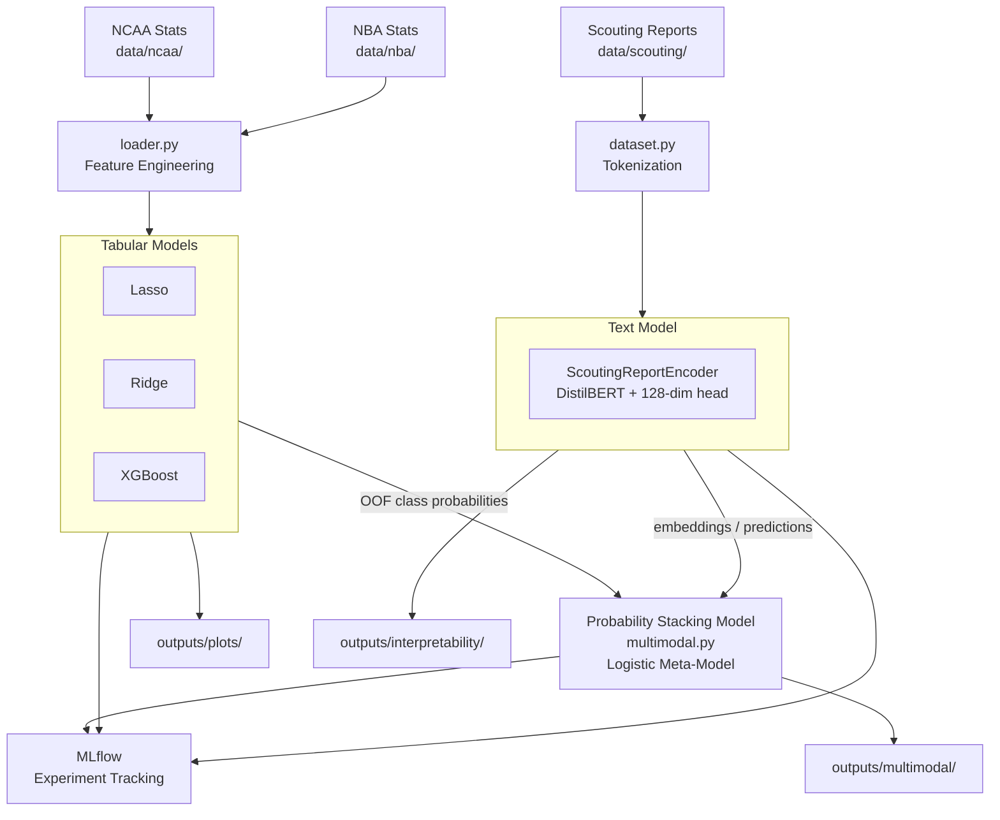

# NBA Draft ML Research

## Project Summary

This is an ML research system for predicting NBA draft prospect success using college basketball data. The goal is to estimate how well an NCAA prospect will perform professionally before they are drafted.

**Three model tiers:**

1. **Tabular models** — Lasso, Ridge, and XGBoost trained on NCAA per-game statistics (points, rebounds, assists, shooting percentages, etc.) plus engineered features (true shooting %, assist-to-turnover ratio, usage proxy, position-relative height, team difficulty score).
2. **Text model** — A DistilBERT-based encoder (`ScoutingReportEncoder`) fine-tuned on scouting report texts, producing a 128-dim embedding with regression and binary classification heads.
3. **Multimodal stacking (PSM)** — A Probability Stacking Model that trains base classifiers via out-of-fold (OOF) cross-validation, collects their held-out probability vectors, and fits a logistic regression meta-model to optimally combine all signals.

**Prediction targets:**

| Target | Type | Description |
|---|---|---|
| `plus_minus` | Regression | Best-season NBA PLUS_MINUS |
| `composite_score` | Regression | Weighted blend of NBA minutes, games, and plus-minus |
| `nba_role_zscore` | Regression | Z-scored aggregate across NBA box-score stats |
| `prospect_tier` | 4-class ordinal | Bust / Bench / Starter / Star (derived from `composite_score` percentiles) |
| `became_starter` | Binary | Started 3+ games in first 3 NBA seasons |
| `survived_3yrs` | Binary | Remained on an NBA roster for 3+ seasons |

**Data sources:**

- `data/ncaa/` — Per-player, per-season NCAA stats (2008–2021+)
- `data/nba/` — Season-by-season NBA stats (2009–10 through 2025–26), draft prospect master list
- `data/scouting/` — Scouting report texts and structured attribute ratings

---

## Codebase Map

### Architecture Flow



---

## Project Structure

```
sport-prospect-grading/
├── src/
│   ├── main.py                         # Entry point — CLI args, config loading, model dispatch
│   ├── config/
│   │   └── config.yaml                 # Centralized config for all model types
│   ├── models/
│   │   ├── regression_model.py         # Lasso / Ridge / XGBoost regression
│   │   ├── classification_model.py     # LogisticL1 / LogisticL2 / XGBoost classification
│   │   ├── text_model.py               # DistilBERT encoder (ScoutingReportEncoder)
│   │   ├── interpret_text.py           # Text model interpretability (probes, occlusion, log-odds)
│   │   ├── multimodal.py               # Probability Stacking Model (OOF + meta-model)
│   │   ├── classification_inference.py # Classification prediction interface
│   │   ├── probability.py              # Probability utilities and calibration
│   │   └── multimodal_reporting.py     # Multimodal output formatting and diagnostics
│   ├── data/
│   │   ├── loader.py                   # Tabular data loading, feature engineering, preprocessing
│   │   └── dataset.py                  # PyTorch Dataset classes for text/multimodal models
│   ├── training/
│   │   ├── trainer.py                  # Neural model training loop (grad clip, checkpointing)
│   │   ├── evaluate.py                 # Metrics: MAE, RMSE, R², accuracy, ROC-AUC, ordinal
│   │   └── splits.py                   # Random, chronological, and repeated stratified CV splits
│   └── utils/
│       ├── device.py                   # Auto-detects CPU / MPS / CUDA
│       ├── features.py                 # Feature name expansion and importance helpers
│       ├── plotting.py                 # Model summary and feature importance plots (local only)
│       └── mlflow_utils.py             # MLflow context, run naming, logging helpers
├── data/
│   ├── nba/                            # NBA master list and per-season stats
│   ├── ncaa/                           # NCAA master list and annual stats
│   ├── scouting/                       # Scouting report texts and structured ratings
│   └── scripts/                        # Data fetch, parse, and reconciliation scripts
├── notebooks/
│   └── 01_eda.ipynb
├── outputs/
│   ├── plots/                          # Per-run local plot output (one subfolder per run name)
│   ├── interpretability/               # Text model interpretability outputs
│   └── multimodal/                     # Multimodal run outputs and diagnostics
├── scripts/
│   ├── start_mlflow_ui.sh
│   └── start_mlflow_server.sh
├── MLFLOW_LOGGING.md                   # MLflow logging specification
└── pyproject.toml
```

#### `src/models/`
- **`regression_model.py`**: Trains Lasso, Ridge, and XGBoost regressors on NCAA stats. Lasso provides feature selection via L1 sparsity; XGBoost uses GridSearchCV.
- **`classification_model.py`**: Trains LogisticL1, LogisticL2, and XGBoost classifiers predicting `prospect_tier`, `became_starter`, or `survived_3yrs`. Supports threshold tuning and optional probability calibration.
- **`text_model.py`**: `ScoutingReportEncoder` — DistilBERT base with a 128-dim projection head and multi-task output heads (regression + binary classification). Pass `save_path=` to persist weights for interpretability.
- **`interpret_text.py`**: Probes, aggregated occlusion, corpus log-odds, VADER sentiment correlations, and `outputs/interpretability/REPORT.md` for all prediction heads.
- **`multimodal.py`**: Probability Stacking Model (PSM) — trains base models via stratified K-fold OOF, concatenates held-out class probability vectors, fits a logistic regression meta-model.
- **`classification_inference.py`**: Prediction interface for the classification pipeline.
- **`probability.py`**: Probability utilities, Brier score / log-loss calibration helpers.
- **`multimodal_reporting.py`**: Formats and writes multimodal run diagnostics and summary outputs.

#### `src/training/`
- **`trainer.py`**: Training loop for neural models with gradient clipping, checkpoint saving, and early stopping.
- **`evaluate.py`**: Regression metrics (MAE, RMSE, R²), classification metrics (accuracy, balanced accuracy, ROC-AUC, macro F1), and ordinal metrics (within-one accuracy, distance-weighted accuracy, quadratic weighted kappa).
- **`splits.py`**: `get_random_split()`, `get_chronological_split()`, `get_repeated_stratified_cv()`.

#### `src/data/`
- **`loader.py`**: Loads and merges NCAA/NBA CSVs, engineers all features (shooting efficiency, usage proxy, team difficulty, position-relative height), applies StandardScaler + OneHotEncoder.
- **`dataset.py`**: PyTorch Dataset classes — `ProspectStatsDataset` (tabular), `ScoutingReportDataset` (tokenized text), `MultimodalProspectDataset` (combined).

#### `src/utils/`
- **`device.py`**: Auto-detects and logs compute device (CUDA > MPS > CPU); respects `DEVICE` env var.
- **`features.py`**: Feature name expansion, Lasso coefficient display, XGBoost feature importance ranking.
- **`plotting.py`**: Feature importance, model comparison, and results plots. Uses Matplotlib Agg backend (non-interactive).
- **`mlflow_utils.py`**: Parent + nested child run structure, parameter/metric/artifact logging helpers.

#### `src/config/`
- **`config.yaml`**: Centralized YAML configuration for model type, target, feature flags, hyperparameter search ranges, training settings, data paths, and MLflow tracking URI.

### Data Processing Scripts

#### `data/scripts/`
- **`fetch_nba_stats.py`**: Fetches season-level NBA stats (PLUS_MINUS, box scores) using nba-api for all players across draft classes.
- **`parse_ncaa_stats.py`**: Parses NCAA stats from raw data into structured DataFrames.
- **`reconcile_master.py`**: Reconciles NCAA and NBA data to link prospects with their professional performance.
- **`recover_nba_players.py`**: Recovers missing NBA players from the master list.
- **`backfill_ncaa_stats.py`**: Fills gaps in NCAA stats from ESPN box scores.
- **`reconcile_from_ncaa_master.py`**: Alternative reconciliation path from the NCAA master list.
- **`backfill_profile.py`**: Augments player profiles with additional data.
- **`augment_new_seasons.py`**: Extends the dataset with new season data.
- **`validate_recovered_players.py`**: Validates player recovery output.

### Data Directories

#### `data/nba/`
- **`nba_master.csv`**: Master list of NBA draft prospects mapped to professional performance.
- **`nba_stats_best_season.csv`**: Best-season NBA stats (highest PLUS_MINUS) for each drafted prospect.
- **`nba_stats_best_season_vorp.csv`**: Best-season NBA stats using VORP as the selection criterion.
- **`season_cache/`**: Season-by-season NBA stats (2009–10 through 2025–26).

#### `data/ncaa/`
- **`ncaa_master.csv`**: Master list of NCAA prospects.
- **`ncaa_stats_master.csv`**: Aggregated NCAA statistics.
- **`YYYY-ZZZZ.csv`**: Annual NCAA stats files.

#### `data/scouting/`
- **`players.csv` / `players.jsonl`**: Structured scouting ratings and player attributes.
- **`scouting_texts.txt`**: Raw scouting report texts used to train the text model.

### Configuration & Infrastructure

- **`pyproject.toml`**: Project metadata and dependencies (PyTorch, Transformers, scikit-learn, MLflow, nba-api).
- **`notebooks/01_eda.ipynb`**: Exploratory data analysis notebook.
- **`mlruns/`**: MLflow experiment tracking artifacts and model snapshots.
---

## Setup

### Prerequisites

- Python 3.11 or 3.12
- [uv](https://docs.astral.sh/uv/getting-started/installation/) package manager

### Install

```bash
git clone <repo-url>
cd sport-prospect-grading
uv sync
cp .env.example .env
# Edit .env if needed (see Environment Variables below)
```

---

## Running Models

All models are launched through `src/main.py`. The `--model` flag selects the pipeline and is the primary switch.

### Basic usage

```bash
uv run python src/main.py --model regression
uv run python src/main.py --model classification
uv run python src/main.py --model text
```

### All CLI arguments

| Argument | Type | Default | Description |
|---|---|---|---|
| `--model` | `regression \| classification \| text \| multimodal` | value from `config.yaml` | Selects which model pipeline to run. Overrides `model.type` in config. |
| `--config` | path | `src/config/config.yaml` | Path to the YAML config file. |
| `--run-name` | string | auto-generated | MLflow parent run name. **Use this to label and differentiate runs.** |
| `--epochs` | int | value from config | Override `training.epochs` for text/multimodal models. |
| `--output-dir` | path | value from config | Override the output directory. |
| `--tracking-uri` | URI or path | value from config or `MLFLOW_TRACKING_URI` env var | Override the MLflow tracking URI for this run only. |

### Naming runs

The `--run-name` flag is the recommended way to distinguish runs when comparing results in MLflow.

```bash
# Label a regression run clearly for comparison
uv run python src/main.py --model regression --run-name regression-baseline-no-pick
uv run python src/main.py --model regression --run-name regression-with-pick

# Label a classification run by target
uv run python src/main.py --model classification --run-name clf-survived3yrs-v1
```

### Text model interpretability

Train with a checkpoint path, then run interpretability (from repo root):

```bash
uv run python -c "from src.models.text_model import train_and_evaluate_text_model; train_and_evaluate_text_model(save_path='outputs/checkpoints/text_model.pt')"

uv run python -m src.models.interpret_text --checkpoint outputs/checkpoints/text_model.pt
```

Fast run (smaller/faster occlusion):

```bash
uv run python -m src.models.interpret_text --checkpoint outputs/checkpoints/text_model.pt --n-occlusion 20 --max-variants-per-report 40
```

Use `--retrain --checkpoint-out ...` to train and interpret in one step. Outputs land in `outputs/interpretability/`.

### Jupyter Notebook
If `--run-name` is omitted, a name is auto-generated using the pattern:

```
{model_type}-{target}-{YYYYMMDD-HHMMSS}-{user}-{git_sha}
```

Example: `regression-plus_minus-20260423-143012-kincaid-c79bc0f`

The run name is used as:
- The MLflow parent run name
- The subfolder name under `outputs/plots/` where local PNGs are saved

---

## Configuration

`src/config/config.yaml` controls all model behavior. CLI flags override specific fields at runtime; all other values come from the file.

### Regression (`--model regression`)

```yaml
model:
  regression:
    target_mode: plus_minus       # only supported target
    use_draft_pick: false         # set true to include draft pick position as a feature
    alpha_min: 1e-4               # Lasso/Ridge alpha search range (lower bound)
    alpha_max: 1e2                # Lasso/Ridge alpha search range (upper bound)
    alpha_steps: 100              # number of alpha candidates
    max_iter: 10000               # Lasso max iterations
    cv_folds: 5                   # CV folds for Lasso and Ridge
    xgboost:
      n_estimators: [100, 200]    # grid search values
      max_depth: [2, 3]
      learning_rate: [0.05, 0.1]
      subsample: [0.8]
      cv_folds: 3                 # CV folds for XGBoost grid search
      n_jobs: 1                    # XGBoost worker threads; keep 1 on macOS for stability
      grid_n_jobs: 1               # GridSearchCV worker processes
      pre_dispatch: 1              # Jobs queued ahead of active workers
```

Trains three models: **Lasso**, **Ridge**, **XGBoost**. Each gets its own nested MLflow run under the parent. XGBoost uses `GridSearchCV` over the values listed above.

### Classification (`--model classification`)

```yaml
model:
  classification:
    target_mode: survived_3yrs    # survived_3yrs | became_starter
    use_draft_pick: false
    xgboost:
      n_estimators: [100, 200]
      max_depth: [2, 3]
      learning_rate: [0.05, 0.1]
      subsample: [0.8]
      cv_folds: 3
      n_jobs: 1
      grid_n_jobs: 1
      pre_dispatch: 1
```

Trains three models: **LogisticL1**, **LogisticL2**, **XGBoost**. Target can be switched to `became_starter` to change the binary outcome being predicted.

On macOS, XGBoost needs an OpenMP runtime (`libomp.dylib`). The CLI will automatically restart tabular runs with `DYLD_FALLBACK_LIBRARY_PATH` when it finds `libomp` in common Homebrew or Conda locations.

### Known issue: XGBoost runs stuck in MLflow

Regression and classification runs previously appeared to hang at `Running` in the MLflow UI, with no XGBoost output and no PNGs under `outputs/plots/{run_name}/`. The process was not hanging in Python; it was crashing during the XGBoost phase before the parent MLflow run context could close. Because plot generation happens after model training returns, the crash also prevented result plots from being written.

The fix is implemented in code and config:
- XGBoost now runs inside its own nested MLflow child run, so XGBoost work is tracked under `...__xgboost`.
- XGBoost and `GridSearchCV` default to single-worker execution through `n_jobs: 1`, `grid_n_jobs: 1`, and `pre_dispatch: 1`, avoiding unstable nested native parallelism.
- The project is pinned to Python 3.11/3.12 instead of floating to Python 3.13.
- Plotting uses the non-interactive Matplotlib `Agg` backend and closes figures after saving, so training scripts do not block on GUI display.
- On macOS, `src/main.py` restarts tabular runs with a `DYLD_FALLBACK_LIBRARY_PATH` pointing at a detected `libomp.dylib` when needed by XGBoost.

If old runs still show `Running`, they are stale records from a process that crashed before MLflow could mark them finished. New runs should complete normally and write plots to `outputs/plots/{run_name}/`.

### Text model (`--model text`)

```yaml
model:
  text:
    pretrained: "distilbert-base-uncased"
    output_dim: 128
    max_length: 512
    freeze_base: false            # set true to freeze transformer weights
training:
  batch_size: 32
  lr: 1e-3
  epochs: 50
  early_stopping_patience: 10
```

### Shared training settings

```yaml
training:
  batch_size: 32
  lr: 1e-3
  weight_decay: 1e-4
  epochs: 50
  early_stopping_patience: 10
  grad_clip: 1.0
  seed: 42
```

---

## MLflow Tracking

### What gets logged

Every run logs the following to MLflow, organized as a parent run with one nested child run per model:

**Parent run (top-level summary)**
- Model family, target variable, `use_draft_pick`
- Dataset size, train/test split sizes, test fraction, random seed
- Regression: target mean, std, min, max
- Classification: class balance, positive/negative counts
- Best model name and its test metric (`best_r2` or `best_auc`)
- Python version, sklearn/xgboost/mlflow versions, device
- Full resolved config as `config/config.json` artifact
- `candidate_summary.json` artifact listing every model's test metrics and CV score

**Each child run (one per estimator)**
- Estimator name, target, `use_draft_pick`, random seed
- Final selected hyperparameter (alpha for Lasso/Ridge, best grid params for XGBoost)
- Search space range (alpha min/max/n for linear models; C min/max/n for logistic)
- CV fold count
- XGBoost only: `best_cv_score` (best CV R²/ROC-AUC from grid search)
- Test metrics: R²/RMSE/MAE (regression) or accuracy/ROC-AUC (classification)
- Fitted model artifact

**Local outputs only (not uploaded to MLflow)**
- `regression_results.png` / `classification_results.png`
- `feature_importance.png`
- `importance_heatmap.png`
- `model_summary.png`

### Local plot output

All PNGs for a run are written to:

```
outputs/plots/{run_name}/
```

Each run gets its own subfolder named by the MLflow parent run name, so runs never overwrite each other.

### MLflow UI

```bash
# View runs in the default local store
uv run mlflow ui --backend-store-uri ./mlruns

# Or use the included script
bash scripts/start_mlflow_ui.sh
```

### Shared team tracking

To make runs visible across group members, point everyone to the same backend. Set `MLFLOW_TRACKING_URI` in `.env` or in `config.yaml` under `logging.mlflow.tracking_uri`:

```bash
# Shared server
MLFLOW_TRACKING_URI=http://host:5000

# Shared mounted folder
MLFLOW_TRACKING_URI=/Volumes/SharedDrive/sport-prospect-grading/mlruns
```

MLflow run names and the nested structure (parent + child per estimator) make it straightforward to filter and compare runs across team members in the UI.

---

## Environment Variables

Set these in `.env` at the project root:

| Variable | Description |
|---|---|
| `MLFLOW_TRACKING_URI` | MLflow backend URI (overrides config). Use for shared team tracking. |
| `MLFLOW_ARTIFACT_LOCATION` | Shared artifact root for new experiments. |
| `MLFLOW_RUN_NAME` | Default run name if `--run-name` is not passed. |
| `MODEL_PLOTS_DIR` | Override the local plot output directory. |
| `DEVICE` | Force compute device: `cpu`, `mps`, or `cuda`. |

---

## Data Scripts

```bash
# Fetch NBA season stats
uv run python data/scripts/fetch_nba_stats.py

# Parse NCAA stats from raw data
uv run python data/scripts/parse_ncaa_stats.py

# Reconcile NCAA and NBA data
uv run python data/scripts/reconcile_master.py

# Backfill missing NCAA stats from ESPN box scores (~2GB, ~2 min)
uv run python data/scripts/backfill_ncaa_stats.py
```

---

## Device Detection

`src/utils/device.py` auto-selects the best available device (CUDA > MPS > CPU). Override via `.env`:

```
DEVICE=mps    # force Apple Silicon GPU
DEVICE=cpu    # force CPU-only
```

Device is logged to MLflow as a reproducibility parameter on every run.
